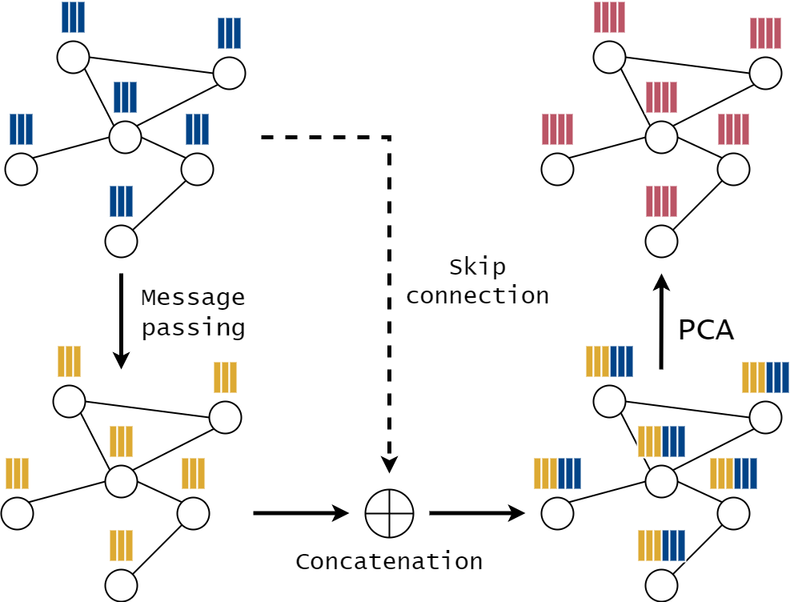
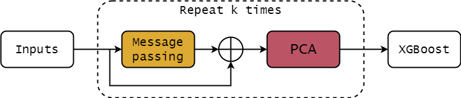

# PCAPass


## Abstract
Graph Neural Networks (GNNs) have become a popular approach for various 
applications, ranging from social network analysis to modeling chemical 
properties of molecules. While GNNs often show remarkable performance on 
public datasets, they can struggle to learn long-range dependencies in the 
data due to over-smoothing and over-squashing tendencies. To alleviate this 
challenge, we propose PCAPass, a method which combines Principal Component 
Analysis (PCA) and message passing for generating node embeddings in an 
unsupervised manner and leverages gradient boosted decision trees for 
classification tasks. We show empirically that this approach provides 
competitive performance compared to popular GNNs on node classification 
benchmarks, while gathering information from longer distance neighborhoods. 
Our research demonstrates that applying dimensionality reduction with message 
passing and skip connections is a promising mechanism for aggregating 
long-range dependencies in graph structured data.

## Results



| dataset       | test accuracy | validation accuracy |
| :-----------: | :-----------: | :-----------------: |
| ogbn-arxiv    | 71.87 ± 0.03  | 73.25 ± 0.05        |
| ogbn-products | 81.15 ± 0.02  | 92.00 ± 0.05        |
| Reddit        | 96.26 ± 0.02  | 96.29 ± 0.04        |

### ogbn-arxiv
```
python main.py \
  --dataset ogbn-arxiv \
  --reverse-edges \
  --self-loop \
  --khop 13 \
  --hidden-feats 241 \
  --max-depth 8 \
  --lr 0.006903882676307294 \
  --gamma 0.78480668337793 \
  --min-child-weight 17.20539445425458 \
  --max-delta-step 2.896607567182113 \
  --subsample 0.6852009988844926 \
  --colsample-bytree 0.8160429788082401 \
  --colsample-bylevel 0.21593167059144303 \
  --colsample-bynode 0.5606966901894666 \
  --dataset-root /home/ksadowski/datasets \
  --submission
```

### ogbn-products
```
python main.py \
  --dataset ogbn-products \
  --self-loop \
  --khop 24 \
  --hidden-feats 169 \
  --max-depth 33 \
  --lr 0.01 \
  --gamma 0 \
  --min-child-weight 26.39442863890919 \
  --max-delta-step 7 \
  --subsample 0.4085169742113201 \
  --colsample-bytree 1 \
  --colsample-bylevel 0.6805684576307726 \
  --colsample-bynode 0.1 \
  --submission
```

### Reddit
```
python main.py \
  --dataset ogbn-arxiv \
  --self-loop \
  --khop 21 \
  --hidden-feats 512 \
  --max-depth 11 \
  --lr 0.00849006640866393 \
  --gamma 0 \
  --min-child-weight 18.772366136169342 \
  --max-delta-step 20 \
  --subsample 0.30809651369356006 \
  --colsample-bytree 0.8952354936925834 \
  --colsample-bylevel 0.49499922610216907 \
  --colsample-bynode 0.1 \
  --submission
```
